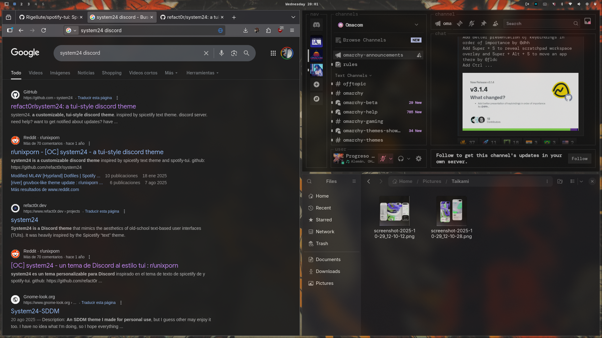

This is Taikami, a monochromatic and professional modern theme designed for Hyprland.





## Components

This theme provides a consistent look and feel across the following components:

- **Window Manager**: Hyprland
- **Status Bar**: Waybar
- **Application Launcher**: Wofi & Walker
- **Terminal**: Alacritty
- **Notification Daemon**: Mako
- **Screen Locker**: Hyprlock
- **On-Screen Display**: SwayOSD
- **System Monitor**: Btop
- **Text Editor**: Neovim & Zed

## Installation

You can install this theme by copying the GitHub URL and selecting `Install > Style > Theme` via the Omarchy menu (`Super + Alt + Space`).

To remove it, use `Remove > Style > Theme` from the same menu and select it from the list.

## Color Palette

The theme uses a simple monochromatic palette:

| Name       | Hex       | Usage                  |
|------------|-----------|------------------------|
| Background | `#282828` | Main background        |
| Foreground | `#d4d4d4` | Main text              |
| Selection  | `#505050` | Selected items, muted text |
| Border     | `#3c3c3c` | Borders, secondary background |
| Accent     | `#ffffff` | Titles, highlighted text |

## Customization

All theme configuration files are located in `~/.config/omarchy/themes/taikami/`. You can modify any file in this directory to customize the theme.

Here are some tips for customizing the theme's appearance. All settings mentioned below are in the `hyprland.conf` file within that path.

### Rounded Corners

To change the corner radius of windows, modify the `rounding` value under the `decoration` section. A value of `0` means sharp, 90-degree corners.

```ini
decoration {
    rounding = 0
    ...
}
```

### Opacity & Transparency

The theme's transparency is controlled by a few properties:

- To change the opacity of active and inactive windows, adjust `active_opacity` and `inactive_opacity` in the `decoration` section. A value of `1.0` is fully opaque, while `0.0` is fully transparent.

```ini
decoration {
    active_opacity = 0.95
    inactive_opacity = 0.93
    ...
}
```

- Background blur can be configured or disabled entirely under `decoration.blur`. To disable it, set `enabled = false`.

```ini
decoration {
    ...
    blur {
        enabled = true
        size = 8
        passes = 2
        ...
    }
}
```
